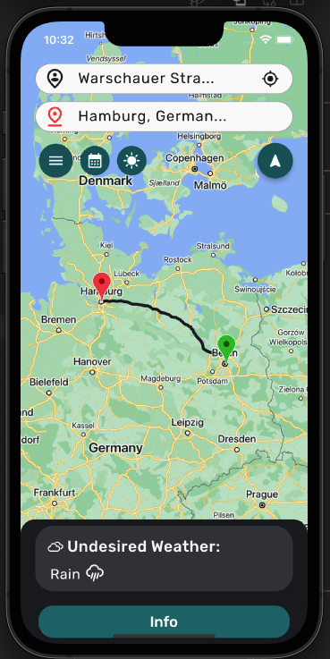
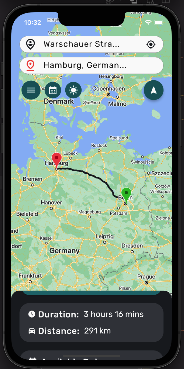
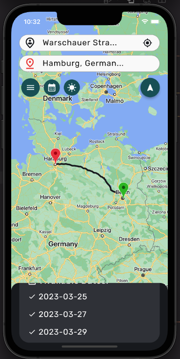
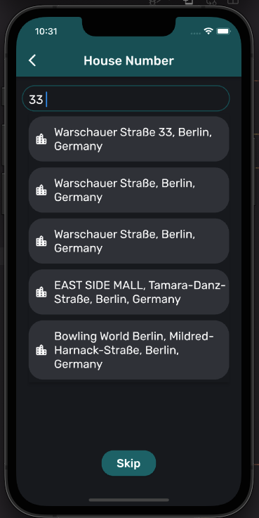

# Shortest Path Application with Flutter

It is a Flutter project that allows user to enter origin and destination points along with undesired weather conditions and time period. This application allows users to see the shortest route and see which dates are suitable for travel according to the selected weather conditions between selected dates. In order to get address information from user, seperate pages are created and connected together with nagivation pattern. Google Places API has been used to take location suggestions for corresponding entry. Additional page for house number is also added for users, who would like to enter a house number as well.

### Build with

- Flutter SDK

### Screenshots from App






## Getting Started

These instructions will allow you to get a copy of the project and running on your local machine for development and testing purposes.

### Prerequisites

- Flutter SDK installed on your machine.
- An editor; you can use either Visual Code or Android Studio.
- An Android or iOS emulator, or a physical device to run the app on.

### Installing

1. Clone the repository to your local machine:

```bash
git clone git@github.com:alper-savas/Route-planner-app.git
```

2. Navigate to the project directory:

```bash
cd /your/path/to/the/local/repository
```

3. Install dependencies:

```bash
flutter pub get
```

4. Connect a physical device or launch an emulator to test the app. You can find instructions on how to set up an emulator or connect a physical device on the Flutter website: https://flutter.dev/docs/get-started/install.

5. Run the app:

```bash
flutter run
```

When this command is not working for you because a null-safety related error, try to run

```bash
flutter run --no-sound-null-safety
```

This will build and launch the app on the connected device or emulator.

One important note: To be able to run this application locally, you have to create a config file and put your Google API key inside that folder.

## Libraries, Tools & Packages Used

- [Flutter Map Docs](https://docs.fleaflet.dev/)
- [Google Autocomplete Docs](https://developers.google.com/maps/documentation/places/web-service/autocomplete)
- [Material UI](https://docs.flutter.dev/development/ui/widgets/material)
- [Internationalization](https://pub.dev/packages/intl)
- [Geolocator](https://pub.dev/packages/geolocator)
- [HTTP](https://pub.dev/packages/http)
- [Convert](https://pub.dev/packages/convert)
- [Async](https://pub.dev/packages/async)
- [Latitude & Longitude](https://pub.dev/packages/latlng)

## Acknowledgements

- [Flutter Docs](https://docs.flutter.dev/)
- [Color Palette & UI](https://coolors.co/)
- [Flutter Map Examples](https://github.com/fleaflet/flutter_map/tree/master/example/lib/pages)
- [Geolocation and Geocoding](https://www.digitalocean.com/community/tutorials/flutter-geolocator-plugin)
